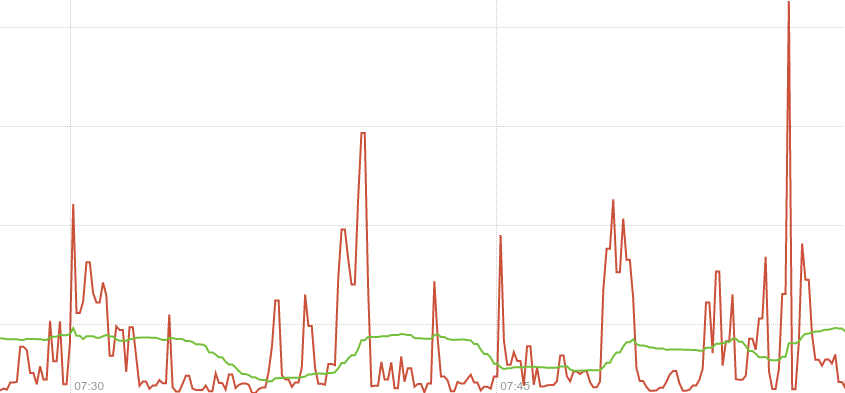
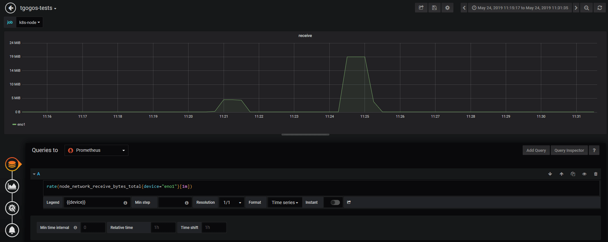
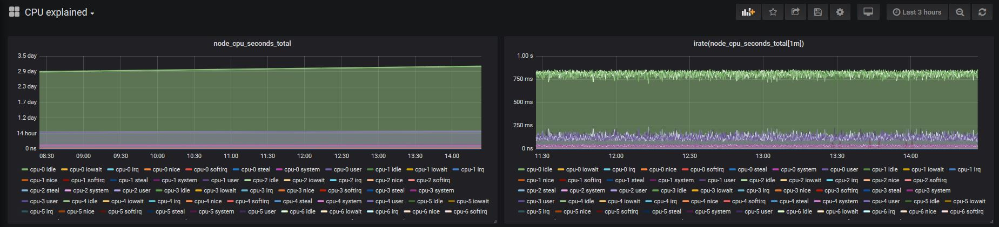
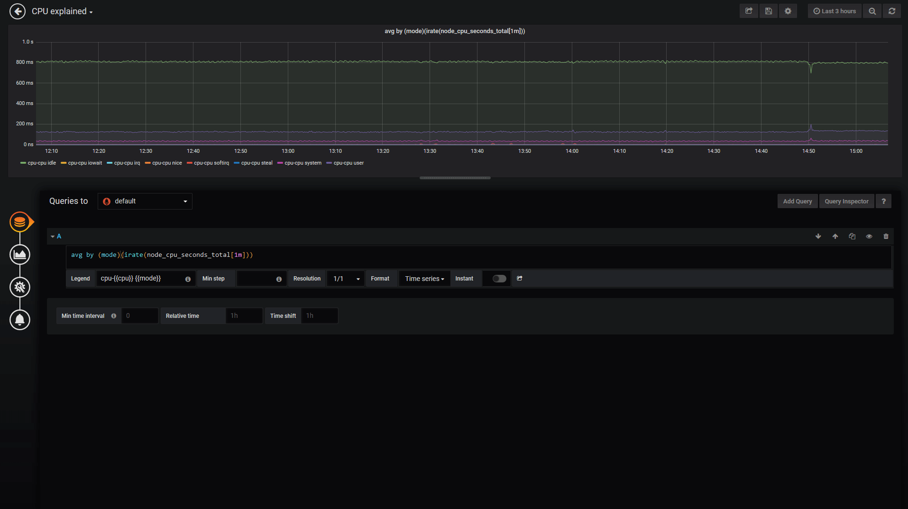
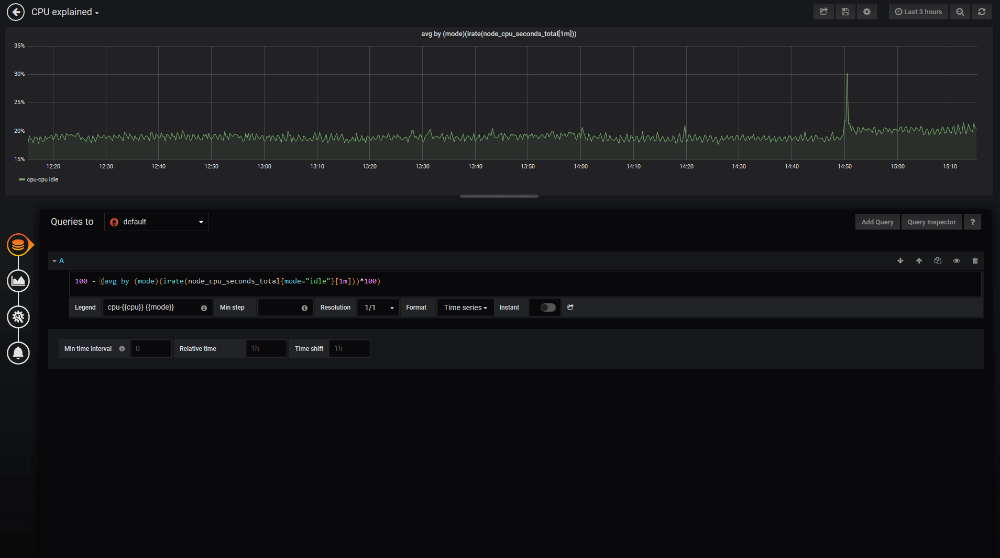
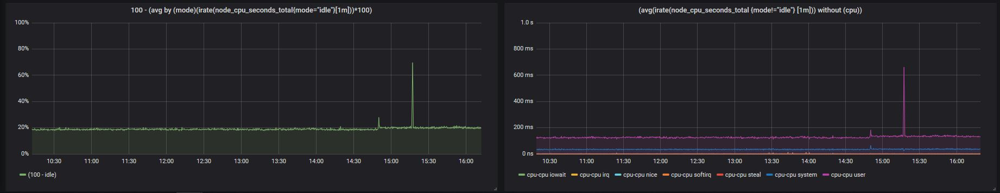

# Prometheus 101

## Doc structure:

 - [Keep-It-Simple](#Keep-It-Simple)
 - [Counters](#Counters) 
 - [Rate()-vs-irate()](#Rate-vs-irate) 
 - [CPU-usage](#CPU-usage) 
 - [Setup-used:-Medianetlab-K8S-cl](#setup-used-medianetlab-k8s-cluster) 

# Keep It Simple

*source: https://www.robustperception.io/keep-it-simple-scrape_interval-id*

**spoiler:** 

- Keep things simple.
- Pick **one** scrape interval, and stick with it.
- Preferably not just per Prometheus, but **across** your team/organisation.
- A value in the range of **10-60s** tends to be good.

## **🤔** Q: How many scrape intervals should I have in a Prometheus?

*In the Prometheus configuration there are two places you can configure the scrape interval: a default in the* `*global*` *section and then per-*`*scrape_config*` *overrides.*
*So you could decide that normally you want to scrape everything every 10s, but there's some key servers that you would like 2s for, and other key ones that are a little slower so maybe 4s is the right setting. Then there's a really slow exporter that needs 1m, and an even slower one that needs 3m. So sounds like 2s, 4s, 10s, 1m and 3m is the way to go!*

**Please don't.**

- The first issue is the complexity of this configuration. Every time a new service is added you need to spend time figuring out which category it falls under, and maybe even add a new value.
- Secondly once the data is in the Prometheus, when writing queries you usually need to know the interval of the underlying data so that you can choose the most appropriate range for your `rate()` . The more intervals you have, the more likely that you'll not get that quite right. In addition working with data with different intervals can be a little tricky, as for example `rate()`s with different ranges are not comparable.

## **🤔** Q: Can I use single-digit seconds interval?

Intervals on the order of single-digit seconds is getting into profiling territory. While a metrics-based system like Prometheus can handle that in certain cases, Prometheus is not a general profiling tool and thus not the most appropriate for the job. Profiling with Prometheus takes some care in design, and is not something you always want to mix in with your general monitoring.

## **🤔** Q: But…  I need higher resolution!

For some problems metrics will not suffice and you will need to incorporate **logs**, **tracing** and/or **profiling** into your debugging. The more instrumentation you have in your code, the easier is to debug as the additional metrics will help you narrow down and correlate issues. For the problems where resolution does matter (e.g. [microbursts](https://en.wikipedia.org/wiki/Micro-bursting_(networking))) it is not guaranteed that metrics will be able to capture the issue, whereas logs should always spot it**.** Metrics are complementary to other types of monitoring and debugging tools, not a replacement. Metrics give you a good view of how things are working at the system and subsystem levels, but don't cover individual requests or instruction-level timings.

# Counters

*sources: https://www.robustperception.io/how-does-a-prometheus-counter-work*

There are [four](http://prometheus.io/docs/concepts/metric_types/) standard types of metric in Prometheus instrumentation:

- Gauge,
- Counter,
- Summary and
- Histogram

## Counters: the problem & the approach

*Example: How does one “count” the requests a system gets per second?*
There are three common approaches.

- The first is that on a regular basis, such as once a minute, you extract the current value which goes to you monitoring system, and reset the counter to 0. This has a problem in that if the push fails, then you lose all information about that time period. This could leave you blind to a [micro burst](https://en.wikipedia.org/wiki/Micro-bursting_(networking)) of traffic. Additionally, if you've two systems pulling data from the counter for redundancy, each will only see about half the increments. That's not great.
- The second approach is to use some form of [Moving Average](https://en.wikipedia.org/wiki/Moving_average#Weighted_moving_average), usually exponential. This means that recent data points have more importance than older data points. Depending on the phase and frequency of the increment pattern, relative to when the monitoring system samples information, you will get different results as not all data points are equal. This approach can handle multiple systems taking samples, but will lose information if a sample fails to be taken. This is better, but far from perfect.
- Prometheus takes the third approach. A counter starts at 0, and is incremented. The client does no other calculations. At each scrape Prometheus takes a sample of this state. The `rate()` function in Prometheus looks at the history of time series over a time period, and calculates how fast it's increasing per second. This can handle multiple Prometheus servers taking samples, and if a scrape fails you'll lose resolution but not data as on the next successful scrape the increments haven't been lost or averaged away.

## Example: “receive_bytes” counter & iperf

I start with `node_network_receive_bytes_total{device="eno1"}` where `{device=``"``eno1``"``}` is used to filter the many metrics received for different devices and continue by adding `irate()` to get the actual graph `irate(node_network_receive_bytes_total{device="eno1"}[1m])`. The 2 spikes shown were caused by 2 iperf tests (default settings 10sec-test).

    # 1st iperf
    - - - - - - - - - - - - - - - - - - - - - - - - -
    [ ID] Interval           Transfer     Bandwidth
    [  4]   0.00-10.00  sec   202 MBytes   169 Mbits/sec                  sender
    [  4]   0.00-10.00  sec   202 MBytes   169 Mbits/sec                  receiver
    
    # 2nd iperf
    [ ID] Interval           Transfer     Bandwidth
    [  4]   0.00-10.00  sec   912 MBytes   765 Mbits/sec                  sender
    [  4]   0.00-10.00  sec   912 MBytes   765 Mbits/sec                  receiver

click to zoom **🔎**

.gif)

The basic idea:

- a counter is a metric that keeps increasing
- rate() calculates a per-second rate for a counter metric
_explained.png)

# Rate() vs irate()

source: https://www.robustperception.io/irate-graphs-are-better-graphs

## irate graphs are better graphs

The `rate` function takes a time series over a time range, and based on the first and last data points within that range (allowing for counter resets) calculates a per-second rate. As it's based on the whole range, it's effectively an average rate over that range - 5 minutes in this case. You can see that the green line in the graph above is slow to pick up on changes, and not showing the full detail.

By contrast `irate` is an instant rate. It only looks at the last two points within the range passed to it and calculates a per-second rate. In the graph above the scrape interval is 10 seconds, so the red line is allowing you to see much briefer spikes and finer detail. This gives you better insight into what's really going on, taking advantage of the full resolution of the data available.

## Example: “receive_bytes” counter & iperf

Notice the wrong per-second rate calculated in the `rate()` case (it shows bytes being received for a whole minute! whereas iperf run for only 10 seconds!).

click to zoom **🔎**

## **🤔** Q: What happens when the process restarts and the counter is reset to 0 (zero)?

`rate()` will automatically handle this. Any time a counter appears to decrease it'll be treated as though there was a reset to 0 right after the first data point. This makes it important that it not be possible for Counters to be decremented, a Counter that has the potential to be decremented is in reality a Gauge.

## **🤔** Q: What happens when scrapping fails?

As with `rate`, `irate` is resilient to scrapes failing as it'll look back to the previous successful scrape. This loses a little resolution, but you don't miss any sudden changes around that failed scrape. This is one advantage of exporting raw counters over rates computed on the instrumented system.

## **🤔** Q: Which one should I use for alerting?

Due to the instant rate being more responsive, there are a few things you should be aware of. If you're doing alerting based on `irate` a very brief dip could reset the alert's `FOR` clause, so prefer `rate` for alerting. In graphs over long time periods used for trending, full resolution data can be distracting so the implicit averaging of `rate` is more useful.

# CPU usage

*from:* [*Understanding Machine CPU usage*](https://www.robustperception.io/understanding-machine-cpu-usage)

Our starting point is a metric exposed by the node-exporter named `node_cpu_seconds_total` which is of type [counter](https://prometheus.io/docs/concepts/metric_types/#counter).

This metric comes from `/proc/stat` and tells us how many seconds each CPU spent doing each type of work:

- **user**: The time spent in userland
- **system**: The time spent in the kernel
- **iowait**: Time spent waiting for I/O
- **idle**: Time the CPU had nothing to do
- **irq&softirq**: Time servicing interrupts
- **guest**: If you are running VMs, the CPU they use
- **steal**: If you are a VM, time other VMs "stole" from your CPUs

Notice that there are 8 different types of “CPU-work” counters. k8s-node (the machine used) has an i7 with 8 CPUs, so this means that we will have to calculate the CPU usage by doing some basic math on: 
`8CPUs x 8types = 64 values`.

The node has been up for about 4 days, that’s why the time counters (on the left) have reached day levels (especially the `idle` ones). If we use `irate()` to calculate the per-second time used (on the right) the results are within the 1 second.

- left picture   :  `node_cpu_seconds_total`
- right picture:  `irate(node_cpu_seconds_total[1m])`

## It’s time to use sum()

To treat the different values coming from the 8 different CPUs as one single value, we can use `sum()`. And because this will end up to values summing up to 8 seconds, we divide it by 8 (the number of CPUs) to make them sum up to 1 second.

- left picture   :  `sum by (mode)(irate(node_cpu_seconds_total[1m]))`
- right picture:  `sum by (mode)(irate(node_cpu_seconds_total[1m])) / 8`

.jpg)

## With avg() it’s more dynamic…

What happens if a machine has 2, 4… etc CPUs? To make the above more dynamic (as it is now you have to hard-code the CPU number) we can just use `avg()` and result to the same graph.

`avg by (mode)(irate(node_cpu_seconds_total[1m]))`

.jpg)

## Calculate CPU usage %

We will use the following logic:
`CPU usage = 100 - (idle_time*100)`  which means that we consider CPU usage everything except the `idle` time. The prometheus query now becomes:
`100 - (avg by (mode)(irate(node_cpu_seconds_total{mode="idle"}[1m]))*100)`
and at the end we also change the graph settings from seconds to percentage.

click to zoom **🔎**

## CPU usage Gauge

The same query can be used to show a gauge by changing the graph type and a few parameters. Notice, that “gauge” here doesn’t mean the [gauge](https://prometheus.io/docs/concepts/metric_types/#gauge) metric type of prometheus. Our metric is still a counter, we just use some graphana settings to show the current (latest) values and ignore the rest of them.

Command used to generate CPU spikes: `stress --cpu 8 --timeout 20`

## Another useful CPU usage graph

In the previous steps we show everything apart from idle (100%-idle) but sometimes we need to see what takes most of the CPU usage. Is it the `system`, is it the `user`, is it an `iowait` which might indicate a disk/network problem? On the left side is what we have already used and on the right a slight modification (values sum up to 1 second):
`(avg(irate(node_cpu_seconds_total {mode!="idle"} [1m])) without (cpu))`

# Setup used: Medianetlab K8S cluster

k8s-master: `10.200.16.2` will run:

- a prometheus server to collect the data
- a grafana to create dashboards

    # docker-compose.yml
    
    version: '3'
    
    services:
    
      prometheus_srv:
        image: prom/prometheus
        container_name: prometheus_server
        hostname: prometheus_server
        restart: always
        volumes:
          - .:/etc/prometheus
        ports:
          - 9090:9090
    
      grafana:
        image: grafana/grafana
        container_name: grafana
        hostname: grafana
        restart: always
        user: "1000"
        volumes:
          - ./grafana_data:/var/lib/grafana
        depends_on:
          - prometheus_srv
        ports:
          - 3000:3000

scrapping:

- prometheus server itself at `10.200.16.2:9090/metrics`
- grafana metrics at `10.200.16.2:3000/metrics`
- prometheus node at `10.200.16.3:9100/metrics`
- container metrics at `10.200.16.3:8080`

    # prometheus.yml
    
    # my global config
    global:
      scrape_interval:     10s # By default, scrape targets every 10 seconds.
      evaluation_interval: 10s # By default, scrape targets every 10 seconds.
    
    scrape_configs:
      # Scrape Prometheus itself (k8s-master)
      - job_name: 'prometheus'
        scrape_interval: 10s
        scrape_timeout: 10s
        static_configs:
          - targets: ['localhost:9090']
    
    # Scrape Prometheus (k8s-node)
      - job_name: 'k8s-node'
        scrape_interval: 10s
        scrape_timeout: 10s
        static_configs:
          - targets: ['10.200.16.3:9100']
    
     # Scrape Grafana metrics
      - job_name: 'grafana'
        scrape_interval: 10s
        scrape_timeout: 10s
        static_configs:
          - targets: ['10.200.16.2:3000']
    
    # Scrape cAdvisor metrics (k8s-node)
      - job_name: cadvisor
        scrape_interval: 10s
        static_configs:
          - targets: [10.200.16.3:8080]

k8s-node: `10.200.16.3` will run:

- a prometheus node-exporter to expose host metrics
- a cAdvisor to expose container metrics

    #node_exporter
    
    sudo docker run -d \
      --net="host" \
      --pid="host" \
      -v "/:/host:ro,rslave" \
      quay.io/prometheus/node-exporter \
      --path.rootfs /host
    
    
    # cAdvisor
    sudo docker run \
      --volume=/:/rootfs:ro \
      --volume=/var/run:/var/run:ro \
      --volume=/sys:/sys:ro \
      --volume=/var/lib/docker/:/var/lib/docker:ro \
      --volume=/dev/disk/:/dev/disk:ro \
      --publish=8080:8080 \
      --detach=true \
      --name=cadvisor \
      google/cadvisor:latest

